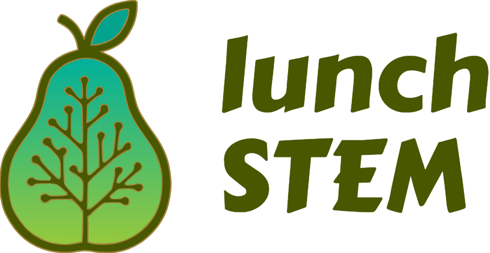

<div align="center">

| | |
|:---:|:---:|
|  |  |

</div>

<h1 align="center">Demokratisierung von <i>STEM</i>-Wissen auf organisierte Weise</h1><br>

<p align="center">
   <strong>🌟 Gemeinnütziges, quelloffenes Projekt (v0.1.0) 🌟</strong>
</p>

<p align="center">
   <em>Denken Sie an eine bessere Wikipedia für <i>STEM</i>.<br>
   Es ist wie FreeCodeCamp, aber für Dokumente (und nicht nur für Software-Engineering).</em>
</p>

<p align="center">
   <a href="https://discord.gg/eYemXMe8A6">
      
   </a>
</p>

<p align="center">
   <a href="README.md">
      
   </a>
   <a href="README.es.md">
      
   </a>
   <a href="README.zh.md">
      
   </a>
   <a href="README.pt.md">
      
   </a>
   <a href="README.fr.md">
      
   </a>
   <a href="README.de.md">
      
   </a>
</p>

<h2 align="center">⭐ Bewerten Sie das Projekt</h2>

Wenn Sie lunchSTEM nützlich finden, erwägen Sie bitte, uns einen Stern auf GitHub zu geben! Das hilft uns, mehr Menschen zu erreichen und hält uns motiviert.

<p align="center">
   <a href="https://github.com/Freelunch-AI/lunch-stem">
      
   </a> <br>
   <em>Beispielbild</em>
</p>

---

## 📚 Inhaltsverzeichnis

- [🔍 Überblick](#-überblick)
- [🎯 Für wen ist das?](#-für-wen-ist-das)
- [📊 Projektstatistiken](#-projektstatistiken)
- [⚙️ Anforderungen für die Nutzung](#-anforderungen-für-die-nutzung)
- [🚀 Verwendung](#-verwendung)
- [📁 Verzeichnisstruktur und Namenskonventionen](#-verzeichnisstruktur-und-namenskonventionen)
- [🔬 Abdeckung von STEM-Bereichen](#-abdeckung-von-stem-bereichen)
- [🤝 Beiträge](#-beiträge)
- [🗺️ Roadmap-Versuch](#-roadmap-versuch)
- [🗑️ Inhaltsentfernung und Quellenangabe-Anfragen](#-inhaltsentfernung-und-quellenangabe-anfragen)
- [📝 Quellenangabe](#-quellenangabe)
- [⚖️ Haftungsausschluss & Bedingungen](#-haftungsausschluss--bedingungen)
- [💎 Sponsoren](#-sponsoren)
- [🙏 Danksagungen](#-danksagungen)

## 🔍 Überblick

Dies ist eine sich entwickelnde *STEM* (Science, Technology, Engineering and Mathematics) Wissensdatenbank, die mit der Anstrengung der Community überprüft und verbessert werden soll. Sie kann von Menschen und KI-Agenten genutzt und verbessert werden.

Der ideale Anwendungsfall ist, sie zu verwenden, um **tief in ein *STEM*-Thema (und verwandte Themen) einzutauchen, nachdem Sie ein grundlegendes Verständnis davon haben** (das Sie leicht über Google-Suche oder KI-Assistenten erhalten können).

Sie sollte organisierter und qualitativ hochwertiger (Signal-zu-Rausch-Verhältnis) sein als die Standard-Google-Suche/KI-Tiefenforschung für diesen Anwendungsfall.

Das Ziel ist es, später KI-Agenten zu ermöglichen, sie leicht als Werkzeug zu verwenden, indem ein *lunchSTEM MCP Server* erstellt wird.

## 🎯 Für wen ist das?

- **Studenten**, die nach ergänzenden Lernmaterialien suchen
- **Fachkräfte**, die ihr STEM-Wissen vertiefen möchten
- **Forscher**, die organisierte Referenzmaterialien benötigen
- **Pädagogen**, die nach Unterrichtsmaterialien suchen
- **Selbstlerner**, die ein unabhängiges Studium verfolgen

## 📊 Projektstatistiken

- **Größe:** 60+ GB (einschließlich vieler Links)
- **Anzahl der PDF-Dateien:** 10k+
- **Anzahl der Unterthemen:** 6k+
- **Sprache der Materialien:** Englisch

## ⚙️ Anforderungen für die Nutzung

Stellen Sie sicher, dass Sie diese Tools installiert haben:

- `git`
- `rclone`

Diese können installiert werden, indem Sie deren jeweilige Installationsanleitung auf ihren Websites befolgen.

- [git Installationsanleitung](https://git-scm.com/book/en/v2/Getting-Started-Installing-Git)
- [rclone Installationsanleitung](https://rclone.org/install/)

> [!NOTE]
> Bei der Konfiguration eines Remote-Speichers für _rclone_ stellen Sie sicher, dass Sie die Service-Account-Option verwenden und `lunch-stem-fadf503639fe.json` als Service-Account-Datei.
>
> Beim Installieren von *rclone* sehen *Windows*-Benutzer möglicherweise eine Sicherheitswarnung, das ist normal.

## 🚀 Verwendung

1. **Terminal öffnen**: Um das Terminal zu öffnen, verwenden Sie das Suchfeld Ihres Betriebssystems.

- Für *Linux*: suchen Sie nach "terminal"
- Für *Windows*: suchen Sie nach "powershell" und klicken Sie auf "Windows Powershell"

2. **Repository mit git klonen** (dieser Befehl erstellt einen `lunch-stem` Ordner in Ihrem aktuellen Verzeichnis)

   ```bash
   git clone https://github.com/Freelunch-AI/lunch-stem.git
   ```
   > [!NOTE]
   > Wenn Sie Windows verwenden, ist es wichtig, innerhalb eines Top-Level-Verzeichnisses zu klonen, um potenzielle Fehler im Zusammenhang mit der Erstellung von Dateipfaden zu vermeiden, die zu lang sind. Windows hat typischerweise einen maximalen Dateipfad von 260 Zeichen.

   > [!NOTE]
   > Der `git clone` Befehl kopiert das Projekt mit der gesamten bereits vorhandenen Ordnerstruktur auf Ihren Computer.

3. Geben Sie den `lunch-stem` Ordner ein

   ```bash
   cd lunch-stem
   ```

4. Projekt einrichten

   **Für Linux**

   rclone konfigurieren

   _Bash_-Skriptausführung aktivieren

   ```bash
   chmod +x scripts/setup 
      ```

   Setup-Skript ausführen

   ```bash
   source scripts/setup 
      ```

   Sie sollten die Nachricht `Setup complete!` im Terminal gedruckt sehen, zusammen mit anderen Details.

   **Für Windows:**

   Ausführung von Skripten innerhalb der _PowerShell_-Sitzung aktivieren

   ```powershell
   Set-ExecutionPolicy -ExecutionPolicy Bypass -Scope Process
      ```

   Setup-Skript ausführen

   ```powershell
   scripts/setup.ps1
      ```

   Sie sollten die Nachricht `Setup complete!` im Terminal gedruckt sehen, zusammen mit anderen Details.

5. **Im `ai2f` Ordner stöbern**

   `ai2f` Ordnerstruktur:

         ├── __Loopback
         ├── Computer Science and Engineering 
         ├── Hardcore Engineering 
         ├── Hardcore Science  
         └── Mathematics

6. **PDF-Dateien herunterladen:**

   - Für `.pdf.dvc` Dateien

      **Spezifische PDF-Dateien herunterladen mit:**

      ```bash
      lunch files "<erster/dvc/datei/pfad/platzhalter.pdf.dvc>" "[zweiter/dvc/datei/pfad/platzhalter.pdf.dvc]"
      ```

      wobei Sie mehrere Dateipfade angeben können, nur der erste ist erforderlich.

      Dieser Befehl holt die `.pdf` Dateien und legt sie in Ihr aktuelles Verzeichnis.

> [!WARNING]
> **`/` oder `\` als Trennzeichen in den Pfaden?**
>
> `Linux` akzeptiert nur `/`
>
> `Windows` akzeptiert beide.

> [!WARNING]
> Ist es notwendig, Pfade in `""` Anführungszeichen zu setzen?
>
> Ja, das ist notwendig. Denn viele Pfade haben Verzeichnisse und/oder Dateien mit Leerzeichen. **Wenn Sie den Pfad nicht in `""` Anführungszeichen setzen, funktioniert der Befehl nicht.**

> [!TIP]
> **Beispiel-Verwendung mit absoluten Pfaden:**
> Angenommen `aktueller_pfad` == `"D:\coding-workspace\lunch-stem"`
> 
> ```bash
> lunch files "D:\coding-workspace\lunch-stem\ai2f\__Loopback\1 - OS Fundamentals_56b97b\3 - OS, Virtual Memory, OS Abstractions.pdf.dvc" "D:\coding-workspace\lunch-stem\ai2f\__Loopback\1 - OS Fundamentals_56b97b\4 - Bounded Buffers, Concurrency, Locks.pdf.dvc" "D:\coding-workspace\lunch-stem\ai2f\__Loopback\1 - OS Fundamentals_56b97b\5 - Threads, Condition Variables, Preemption.pdf.dvc"
> ```
> Lädt `3 - OS, Virtual Memory, OS Abstractions.pdf`, `4 - Bounded Buffers, Concurrency, Locks.pdf` und `5 - Threads, Condition Variables, Preemption.pdf` in `aktueller_pfad` herunter.

> [!TIP]
> **Beispiel-Verwendung mit relativen Pfaden (relativ zum aktuellen Pfad, in dem Sie den Befehl ausführen):**
> Angenommen `aktueller_pfad` == `"D:\coding-workspace\lunch-stem\ai2f\__Loopback\1 - OS Fundamentals_56b97b"`
> 
> ```bash
> lunch files "3 - OS, Virtual Memory, OS Abstractions.pdf.dvc" "4 - Bounded Buffers, Concurrency, Locks.pdf.dvc" "5 - Threads, Condition Variables, Preemption.pdf.dvc"
> ```
> Lädt `3 - OS, Virtual Memory, OS Abstractions.pdf`, `4 - Bounded Buffers, Concurrency, Locks.pdf` und `5 - Threads, Condition Variables, Preemption.pdf` in `aktueller_pfad` herunter.

   - (fortsetzung) <br>
      Wenn Sie Dateien an derselben Stelle wie die `pdf.dvc` Datei ablegen möchten, verwenden Sie:

      ```bash
      lunch files "<erster/dvc/datei/pfad/platzhalter.pdf.dvc>" "[zweiter/dvc/datei/pfad/platzhalter.pdf.dvc]" --in-place
      ```

      - _Hinweis 1:_ Das erste Dateipfad-Argument ist erforderlich, der Rest ist optional.
      - _Hinweis 2:_ Der in diesem Befehl verwendete Dateipfad sollte nicht mit `.source.json` enden. Er sollte mit `.pdf.dvc` enden.
      - _Hinweis 3:_ Andere Dateitypen (z.B. `.txt`) sollten direkt geöffnet werden, ohne die lunch CLI zu verwenden.
      - _Hinweis 4:_ Wenn `.web.txt` vorhanden ist, sollten Sie diesen Befehl nicht versuchen, kopieren Sie einfach den Link innerhalb von `.web.txt` und fügen Sie ihn in Ihren Browser ein. Wir werden später ein `lunch get` implementieren, um Dateien aus dem Web zu holen.
      - _Hinweis 5:_ Die `.pdf` Datei sollte nicht sichtbar sein, bevor Sie diesen Befehl ausführen.
      - _Hinweis 6:_ Sie können die Dateipfade über die grafische Benutzeroberfläche Ihres Betriebssystems erhalten, jedes Betriebssystem hat einen einfachen Weg.


      **Alle Dateien aus einem bestimmten Ordner herunterladen über:**

      ```bash
      lunch folder "<ordner/pfad/platzhalter>"
      ```

      Wenn Sie die neuen PDF-Dateien an derselben Stelle wie ihre entsprechenden `pdf.dvc` Dateien ablegen möchten, verwenden Sie:

      ```bash
      lunch folder "<ordner/pfad/platzhalter>" --in-place
      ```

      Wenn Sie alle Dateien aus allen Unterverzeichnissen (rekursiv) herunterladen möchten, verwenden Sie:

      ```bash
      lunch folder "<ordner/pfad/platzhalter>" --recursive
      ```

      Wenn Sie Dateien an derselben Stelle wie die `pdf.dvc` Datei und für alle Unterverzeichnisse ablegen möchten, verwenden Sie:

      ```bash
      lunch folder "<ordner/pfad/platzhalter>" --in-place --recursive
      ```
      Für Debugging verwenden Sie das `--verbose` Flag.

   - Für `pdf.web.txt` Dateien:

      Öffnen Sie einfach die Datei und folgen Sie dem Weblink darin.

   - Für `.sym.txt` Dateien:

      Öffnen Sie einfach die Datei und navigieren Sie zu dem darin geschriebenen Datei- oder Ordnerpfad. Diese Datei oder dieser Ordner befindet sich innerhalb des `__Loopback`.

> [!WARNING]
> **⚠️ Wichtig**
> 
> Dokumente in *lunchSTEM* werden von externen Autoren erstellt, nicht von uns. Wir unterstützen nicht die Aufnahme von nicht-verteilbaren Dokumenten ohne Autorenerlaubnis (für nicht-verteilbare Dokumente: überprüfen Sie `author_permissions.jsonl`).
> 
> Jedes Dokument würdigt seine Autor(en) in einer entsprechenden `<dateiname>.<dateierweiterung>.source.json` Datei.
> 
> Autoren können jederzeit die Entfernung von Inhalten anfordern. Nach dem Befolgen unseres vereinfachten Protokolls für *Inhaltsentfernungsanfragen* entfernen wir Inhalte innerhalb von 24 Stunden. Diese Option ist schneller und freundlicher als eine *Digital Millennium Copyright Act (DMCA)* Benachrichtigung (die das Projekt herunterfahren kann).

> [!NOTE]
> **🟩 Demnächst verfügbar**
> 
> • **Browser-App** mit Autoren-Homepages, Schlüsselwort-/semantischer Suche, Diskussionsforen über Dokumenten, Inhaltsvorschauen, interaktiven Inhaltsvisualisierungen, Inhaltsbewertung/Tagging/Favorisierung, Notizen über Dokumenten, trending/beliebte Dokumente, Statistiken für Dokumente und Autoren und mehr.
> 
> • **MCP Server:** nützlich für KI-Agenten, die komplexe Ingenieursarbeit oder wissenschaftliche Forschung durchführen.
> 
> • **Richtige CLI**, wo Benutzer Schlüsselwort- und semantische Suche durchführen können.

## 📁 Verzeichnisstruktur und Namenskonventionen

- **`__Loopback`** Verzeichnis enthält Dateien, die einen zu langen Pfad hatten. Eine Zeiger-`.sym.txt` Datei wurde anstelle dieser Dateien erstellt, die auf die tatsächliche Datei im `__Loopback` Verzeichnis zeigt. Diese Zeiger-txt-Dateien folgen dieser Namenskonvention: `dateiname.dateierweiterung.sym.txt` und befinden sich im selben Verzeichnis, wo die tatsächliche Datei sein sollte.

- **`to_add.txt`** Datei im Root enthält Links zu Materialien, die später in lunchSTEM aufgenommen werden sollen.

- Dateien oder Ordner, die mit **MEGA** beginnen, zeigen Aggregator-Materialien an (Materialien, die eine Menge Links zu einem bestimmten Thema aggregieren).

- Dateien oder Ordner, die mit **Awesome** beginnen, zeigen super hochwertige Inhalte an.

## 🔬 Abdeckung von _STEM_ Bereichen

### Stärkste Bereiche

*lunchSTEM* ist im Moment vollständiger in den Bereichen `Computer Science & Engineering` und `AI` speziell.

### Schwächste Bereiche

Die Bereiche `Hardcore Science` (Physik, Chemie, Biologie, Wirtschaft) sind bemerkenswert oberflächlicher in Bezug auf die Tiefe ihres Themenbaumls.

## 🤝 Beiträge

Wenn Sie zum Projekt beitragen möchten, schauen Sie sich unsere [CONTRIBUTING.md](https://github.com/Freelunch-AI/lunch-stem/blob/main/CONTRIBUTING.md) an.

> [!WARNING]
> Die GCP-Service-Account-Datei ist absichtlich öffentlich in diesem Repository, sie hat nur Leserechte für den Google Drive-Ordner, der die PDFs enthält.
>
> Wir wissen, dass es keine gute Praxis ist, sie öffentlich verfügbar zu machen, aber es war der Weg, um unser bestehendes Google Drive-Abonnement zu nutzen (ohne ein global skalierbares Backend erstellen zu müssen).
>
> Wir werden bald zu einem öffentlichen S3-Bucket wechseln, und dann wird dieser kleine "Hack" entfernt.

## 🗺️ Roadmap-Versuch

> **Hinweis:** Schritte mit demselben **[Buchstaben]** können parallel durchgeführt werden.

### Phase A: Grundlegende Probleme

1. **[b][a]** Branch-Namenskonvention und Branch-Regeln erstellen.

2. **[a]** Dringende Urheberrechts- und Quellenangabeprobleme im Zusammenhang mit tatsächlich gespeicherten Dateien lösen
   - CI-Skript erstellen, das eine Liste von `.source.json` Pfaden erstellt, die keine Autoreninformationen haben - diese sollten Priorität haben.

3. **[a]** Tatsächliche Dateien (und Homepage/Einstiegspunkt-Links) durch Links ersetzen, um die Dateien direkt von ihrem ursprünglichen Host zu erhalten (verwenden Sie einen browsernutzenden KI-Agenten, um dabei zu helfen). Das Ziel ist, dass die meisten Dateien `dateiname.dateierweiterung.web.txt` mit dem Link darin sind (d.h. Datei extern gehostet). Benutzer können immer noch mit tatsächlichen Dateien beitragen, wenn sie die Autoren dieser Dateien sind (wie *arXiv* es macht), da wir unter der Haube immer noch DVC für tatsächliche Dateien verwenden werden.

4. **[a]** Richtige Symlinks implementieren, die auf allen Betriebssystemen funktionieren. Kein manuelles Suchen des Pfades innerhalb der `.sym.txt` Datei und manuelles Gehen zu diesem Verzeichnis mehr. Auch einfache Weblinks implementieren, um manuelles Kopieren/Einfügen von Pfaden innerhalb von `.web.txt` in den Browser zu vermeiden.

### Phase B: Wichtige Ergänzungen

5. **[b][a]** Ein ordentliches (nicht in bash, mit Docstrings, modular, mit Tests, kompiliert) *lunchSTEM CLI* Paket/installierbar erstellen, wo Sie:
   1. Dateien oder Verzeichnisse aus dem Web erhalten können.
   2. Bestimmte Dateitypen verstecken/anzeigen können (z.B. verstecken: .dvc, .source.json, .prerequisites.json, Symlinks für andere Betriebssysteme, etc.)
   3. Suche durchführen können: Schlüsselwortsuche und semantische Suche

6. **[b]** Ein *lunchSTEM MCP Server* erstellen: zuerst muss eine `.md` Version jeder `.pdf` erstellt werden

7. **[b][a]** Eine Browser-App erstellen, um den *lunchSTEM* Konsum durch Menschen zu erleichtern, wo Benutzer:
   1. Das Repository als Graph visualisieren und navigieren können
   2. Schlüsselwort-, filter-basierte und semantische Suche verwenden können
   3. Vorschau von Dokumenten sehen können, ohne sie öffnen zu müssen
   4. Dokumente direkt im Browser öffnen können
   5. Ein Dokument bewerten können
   6. Ihr eigenes Tagging/Favorisierung über den Materialien machen können, das nur für sie sichtbar ist
   7. Hervorhebungen und Notizen zu Materialien machen können, die nur für sie sichtbar sind
   8. Autoren-Homepages sehen können, die zu allen Materialien eines bestimmten Autors verlinken
   9. An Diskussionsforen über bestimmte Dokumente teilnehmen können
   10. Trending/beliebte Dokumente und Autoren sehen können
   11. Statistiken für Dokumente und Autoren sehen können

8. **[b]** Sponsoren und Zuschüsse erhalten für: (1) Unterstützung unseres App-Hostings; (2) Aufbau eines dedizierten Teams von *lunchSTEM* Betreuern; (3) Bezahlung von Experten für Peer-Review-Prozesse; und (4) um einen Prozentsatz des Geldes an beitragende Autoren weiterzuleiten. Alles Sponsoring-Geld würde in das Projekt reinvestiert, es ist ein gemeinnütziges Projekt.

9. CI-Workflows erstellen

   1. **[b][a]** Tatsächliche `.pdf` Dateien durch `.pdf.dvc` Dateien ersetzen, um tatsächliche Wissensdateien im Repository zu vermeiden.

   2. **[b][a]** Bösartige Datei-Entfernung, große Datei-Entfernung, Git-Repository-Entfernung, Entfernung von Dateien mit nicht-akzeptierten Erweiterungen, urheberrechtlich geschütztes Material-Entfernung, etc. hinzufügen, um automatisch schlechte PRs zu vermeiden.

   3. **[b][a]** Standard-Konventions-Durchsetzung in CI hinzufügen, um die Wissensdatenbank konsistent zu halten, inkonsistente PRs zu vermeiden.

### Phase C: Weitere Kernfunktionen

10. **[b][c][d]** Funktionen zu *lunchSTEM* hinzufügen, möglicherweise mit *AgentPool* zur Hilfe (parallel: weiterhin mehr Materialien aus `to_add.txt` hinzufügen, aber als `dateiname.dateierweiterung.web.txt` mit dem HTTPS-Link innerhalb der Datei hinzufügen):
    - **Voraussetzungen:** `<dateiname>.<dateierweiterung>.prerequisites.json` hinzufügen, die hierarchische Liste von Voraussetzungen für jede Datei enthält
    - **Übungen:** Übungen mit Lösungen in jedes Themenverzeichnis innerhalb von `__Exercises` stellen
    - **Tools:** Software-Tools in jedes Thema innerhalb von `__Tools` stellen. Können Tools zum Tun oder Verstehen von etwas im Zusammenhang mit dem Thema sein.
    - **Lern- & Zertifizierungsstrecken:** geführte sequenzielle Strecken (z.B. ML Engineer Strecke) mit geschätzter Abschlusszeit von 3 oder 6 Monaten und mit einer internen oder externen Prüfung/Zertifizierung am Ende.
    - **Beispielprojekte:** Beispielprojekte in jedes Themenverzeichnis innerhalb von `__Sample Projects` stellen
    - **KI-Assistent innerhalb der lunchSTEM CLI, um Ihr Dokument leichter verständlich zu machen**: kann Diagramme, Notebook hinzufügen, wir schreiben in leichter verständlichen Worten, machen Beispiele, etc. Ein Trainings-/Prompting-Datensatz kann durch synthetisches absichtliches Verschlechtern guter Lernmaterialien generiert werden.
    - **KI-Tutor, der lunchSTEM als seine Wissensdatenbank verwendet**: Tutor, der benutzerdefinierte Studienführer erstellen, Textblöcke erklären und alle erforderlichen Voraussetzungen lehren, benutzerdefinierte interaktive Materialien erstellen kann, etc.
    - **KI-Peer-Reviewer, der lunchSTEM als seine Wissensdatenbank verwendet**: einen KI-Agenten aufbauen, der neue *STEM* Dokumente überprüfen kann, die in PRs enthalten sind (und die nicht in der Liste der respektierten Quellen stehen), um nicht auf menschliche Peer-Reviews angewiesen zu sein, die langsam und kostspielig sind. Menschliche Peer-Reviews sollten dann jährlich durchgeführt werden, um KI-Peer-Reviewer-Fehler zu fangen und Daten zu generieren, um den KI-Peer-Reviewer an seinen schwachen Punkten zu verbessern.
    - **lunchSTEM Universität:** kostenlose, Online-Universität für Menschen, die strenge Deadlines, Verantwortlichkeiten und das Lernen mit anderen bevorzugen. Keine Prüfungen. Jedes Jahr werden Studenten bestehende Technologien oder Methoden von Grund auf aufbauen, inspiriert von [build-your-own-x](https://github.com/codecrafters-io/build-your-own-x) zusammen mit einer Monographie mit allen wichtigen Details und es mit der Community über einen Blog-Post teilen. Studenten beenden die Universität mit einem hervorragenden Portfolio zum Zeigen. Top-down-Lehransatz, bei dem wir Studenten helfen, Themen bei Bedarf zu lernen, wenn sie es brauchen, um etwas zu bauen.

### Phase D: Nette Verbesserungen

11. **[d]** Von *Google Drive* (ich zahlte bereits für 2TB, deshalb habe ich es verwendet) zu einer besseren Speicheroption (z.B. *S3*) migrieren.

12. **[d]** *AgentPool* erstellen: Team aus vielfältigen Agenten, die PRs zum *lunchSTEM* Repository nach internen Diskussionen machen, Menschen Fragen stellen und vorgeschlagene Änderungen durch Finetuning von SLMs bewerten. Agenten werden kontinuierlich modifiziert, um Vielfalt sicherzustellen und ihre Intelligenz basierend auf genehmigtem neuem Wissen zu verbessern, das zu *lunchSTEM* hinzugefügt wird.

## 🗑️ Inhaltsentfernung und Quellenangabe-Anfragen

Eine große Anstrengung wurde unternommen, um urheberrechtlich geschützte (nicht-verteilbare) Inhalte zu erkennen und zu entfernen und die Autoren/Verleger/Universitäten der verbleibenden Materialien zu erkennen. Eine manuelle Überprüfung jeder Datei konnte aufgrund der schieren Anzahl von Dateien nicht durchgeführt werden (aber wir begrüßen die Community, uns dabei zu helfen, indem sie Issues und PRs öffnet).
1. Wir führten Skripte aus, um jede Datei zu löschen, die eine andere Erweiterung außer: `.pdf`, `.txt`, `.md`, `.ipynb`, `.json` enthält
2. Wir führten Skripte zur automatisierten Erkennung von urheberrechtsbezogenen Schlüsselwörtern in Dokumenten und Löschung solcher Dokumente aus
3. Wir führten Skripte zur automatisierten Entfernung von akademischen Papieren aus
4. Wir ersetzten manuell jede Buch-PDF durch einen Link dazu
5. Wir führten Skripte zur automatisierten Erstellung einer Quellenangabe-Datei (`.source.json`) für jede verbleibende PDF aus, mit Informationen wie: Autoren, Link zur Quelle, modifiziert oder nicht, etc. Standardwert von Feldern sind `null`, mit Ausnahme des Standardwerts des `changes_were_made` Feldes, das `False` ist. Standardwerte werden verwendet, wenn die Informationen nicht in der PDF selbst gefunden werden können.

Wir können jedoch keine Perfektion in diesem Prozess garantieren, daher, wenn Sie urheberrechtlich geschützte Inhalte oder Inhalte ohne ordnungsgemäße Quellenangabedaten finden, öffnen Sie bitte ein Issue und/oder machen Sie eine PR und/oder senden Sie eine E-Mail an bruno.c.scaglione@gmail.com. Wir zielen darauf ab, das Problem in 24h zu lösen. Beziehen Sie sich auf die `CONTRIBUTING.md` Datei für die Richtlinien dafür.

> **Vereinfachtes Protokoll für Inhaltsentfernungsanfragen (Empfohlen über _DMCA_)**
   > 1. Lesen Sie CONTRIBUTING.md, um Issue-Richtlinien zu sehen
   > 2. Öffnen Sie ein *Inhaltsentfernungsanfrage* Issue
   > 3. Senden Sie eine E-Mail an bruno.c.scaglione@gmail.com mit dem Betreff "[lunchSTEM] Inhaltsentfernungsanfrage: #GITHUB_ISSUE_NUMBER_PLACEHOLDER" und erklären Sie: wer Sie sind, der Pfad des/der Inhalts/Inhalte, die entfernt werden müssen, und Link zum spezifischen Issue, das Sie geöffnet haben.

<br>

> Diese Option ist __schneller und freundlicher als eine *DMCA*__ Benachrichtigung. Wenn wir mehrere *DMCA* Benachrichtigungen erhalten, riskiert das Projekt, von *Github* entfernt zu werden (auch nach dem Entfernen der Inhalte) und viele Menschen, die davon profitieren könnten, werden betroffen sein.

***Digital Millennium Copyright Act* (*DMCA*) Compliance:** wir entsprechen dem Digital Millennium Copyright Act (DMCA). Für formelle Takedown-Anfragen folgen Sie bitte dem *DMCA* Prozess.

## 📝 Quellenangabe

Quellenangabedaten einer PDF-Datei werden in `<dateiname>.pdf.source.json` gespeichert, die direkt geöffnet werden sollte (ohne `dvc pull`). Diese Datei kann Autoren, Universität, Verleger, Link zur Quelle und andere Metadaten über die spezifische Datei enthalten, auf die sie sich bezieht. Standardwert von Feldern sind `null`, mit Ausnahme des Standardwerts des `changes_were_made` Feldes, das `False` ist.

## ⚖️ Haftungsausschluss & Bedingungen

**WIE-IST-BASIS:** Dieses Projekt wird "wie-ist" ohne Garantien jeglicher Art bereitgestellt. Wir machen keine Aussagen über die Genauigkeit, Vollständigkeit oder Rechtmäßigkeit des Inhalts.

**HAFTUNGSBESCHRÄNKUNG:** Im größtmöglichen gesetzlich zulässigen Umfang haften die Projektbetreuer nicht für Schäden, die aus der Nutzung dieses Repositories entstehen.

**NUTZUNGSBEDINGUNGEN:** Durch die Nutzung dieses Repositories stimmen Sie zu, Urheberrechtsgesetze zu respektieren, Inhalte nur für Bildungszwecke zu verwenden und alle anwendbaren Gesetze in Ihrer Gerichtsbarkeit einzuhalten.

**KEINE RECHTSBERATUNG:** Nichts in diesem Repository stellt Rechts-, Finanz- oder professionelle Beratung dar.

**Bildungszweck:** Dieses Projekt zielt darauf ab, organisierten Zugang zu Bildungsmaterialien für nicht-kommerzielle, Bildungszwecke zu bieten. Wir glauben, dass viele Verwendungen des Inhalts für Fair-Use-Schutz qualifizieren könnten, aber Fair-Use-Bestimmungen werden von Fall zu Fall von Gerichten getroffen.

## 💎 Sponsoren

__Möchten Sie Sponsor werden? Senden Sie eine E-Mail an bruno.c.scaglione@gmail.com mit dem Betreff "[lunchSTEM] Sponsorship"__ 

## [Freelunch](https://freelunch.dev)


## 🙏 Danksagungen

An alle Autoren, die ihre Inhalte öffentlich verfügbar gemacht haben.

An unsere frühen Tester.

An unsere Mitwirkenden, Betreuer und Sponsoren, die das Projekt am Leben erhalten und weiterentwickeln.
