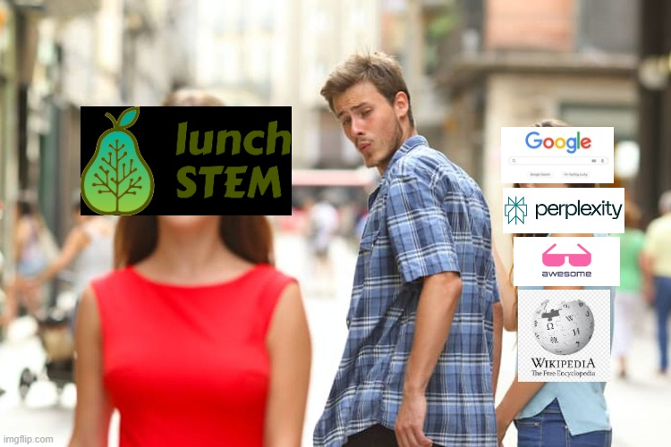

<div align="center">

| | |
|:---:|:---:|
|  |  |

</div>

<h1 align="center">Democratizando o conhecimento <i>STEM</i> de forma organizada</h1><br>

<p align="center">
   <strong>🌟 Projeto sem fins lucrativos e código aberto (v0.1.0) 🌟</strong>
</p>

<p align="center">
   <em>Pense numa Wikipedia melhor para <i>STEM</i>.<br>
   É como o FreeCodeCamp, mas para documentos (e não apenas para Engenharia de Software).</em>
</p>

<p align="center">
   <a href="https://discord.gg/W6wmJbZx">
      
   </a>
</p>

<p align="center">
   <a href="README.md">
      
   </a>
   <a href="README.es.md">
      
   </a>
   <a href="README.zh.md">
      
   </a>
   <a href="README.pt.md">
      
   </a>
   <a href="README.fr.md">
      
   </a>
   <a href="README.de.md">
      
   </a>
</p>

<h2 align="center">⭐ Dar Estrela ao Projeto</h2>

Se você acha o lunchSTEM útil, por favor considere nos dar uma estrela no GitHub! Isso nos ajuda a alcançar mais pessoas e nos mantém motivados.

<p align="center">
   <a href="https://github.com/Freelunch-AI/lunch-stem">
      
   </a> <br>
   <em>Imagem de Exemplo</em>
</p>

---

## 📚 Índice

- [🔍 Visão Geral](#-visão-geral)
- [🎯 Para quem é este projeto?](#-para-quem-é-este-projeto)
- [📊 Estatísticas do Projeto](#-estatísticas-do-projeto)
- [⚙️ Requisitos para Uso](#-requisitos-para-uso)
- [🚀 Como Usar](#-como-usar)
- [📁 Estrutura de Diretórios e Convenções de Nomenclatura](#-estrutura-de-diretórios-e-convenções-de-nomenclatura)
- [🔬 Cobertura dos Campos STEM](#-cobertura-dos-campos-stem)
- [🤝 Contribuições](#-contribuições)
- [🗺️ Tentativa de Roteiro](#-tentativa-de-roteiro)
- [🗑️ Solicitações de Remoção de Conteúdo e Atribuição de Crédito](#-solicitações-de-remoção-de-conteúdo-e-atribuição-de-crédito)
- [📝 Atribuição de Crédito](#-atribuição-de-crédito)
- [⚖️ Isenção de Responsabilidade e Termos](#-isenção-de-responsabilidade-e-termos)
- [💎 Patrocinadores](#-patrocinadores)
- [🙏 Agradecimentos](#-agradecimentos)

## 🔍 Visão Geral

Esta é uma base de conhecimento *STEM* (Ciência, Tecnologia, Engenharia e Matemática) em evolução, destinada a ser revisada e melhorada com o esforço da comunidade. Pode ser usada e melhorada por humanos e agentes de IA.

Seu caso de uso ideal é ser usado para **aprofundar-se em um tópico *STEM* (e tópicos relacionados) depois que você já tem uma compreensão inicial dele** (que você pode facilmente obter via Busca do Google ou Assistentes de IA).

Deve ser mais organizado e de maior qualidade (relação sinal-ruído) do que a busca padrão do Google/pesquisa profunda de IA para este caso de uso.

O objetivo é, mais tarde, permitir que agentes de IA o usem facilmente como uma ferramenta criando um *Servidor MCP lunchSTEM*.

## 🎯 Para quem é este projeto?

- **Estudantes** procurando materiais de aprendizado complementares
- **Profissionais** querendo aprofundar seu conhecimento STEM
- **Pesquisadores** precisando de materiais de referência organizados
- **Educadores** procurando recursos de ensino
- **Autodidatas** perseguindo estudos independentes

## 📊 Estatísticas do Projeto

- **Tamanho:** 60+ GB (incluindo muitos links)
- **Número de arquivos pdf:** 10k+
- **Número de sub-tópicos:** 6k+
- **Idioma dos materiais:** Inglês

## ⚙️ Requisitos para Uso

Certifique-se de ter essas ferramentas instaladas:

- `git`
- `rclone`

Estas podem ser instaladas seguindo seus respectivos guias de instalação em seus sites.

- [Guia de instalação do git](https://git-scm.com/book/en/v2/Getting-Started-Installing-Git)
- [Guia de instalação do rclone](https://rclone.org/install/)

> [!NOTE]
> Ao configurar um armazenamento remoto para _rclone_, certifique-se de usar a opção de conta de serviço e `lunch-stem-fadf503639fe.json` como arquivo de conta de serviço.
>
> Além disso, ao instalar *rclone*, usuários do *Windows* podem ver um aviso de segurança, isso é normal.

## 🚀 Como Usar

1. **Abrir um terminal**: Para abrir o terminal, use a função de pesquisa do seu sistema operacional (pressionando a tecla Windows ou Cmd + Barra de espaço no Mac) e digite "terminal", "Prompt de Comando" ou "Windows Terminal" e selecione o aplicativo

2. **Clonar o repositório com git** (este comando criará uma pasta `lunch-stem` no seu diretório atual)

   ```bash
   git clone https://github.com/Freelunch-AI/lunch-stem.git
   ```
   > [!NOTE]
   > Se você está usando Windows, é importante clonar dentro de um diretório de nível superior, para evitar erros potenciais relacionados à criação de caminhos de arquivo muito longos. O Windows normalmente tem um caminho máximo de arquivo de 260 caracteres.

   > [!NOTE]
   > O comando `git clone` copiará o projeto em sua máquina com toda a estrutura de pastas já no lugar.

3. Entrar na pasta `lunch-stem`

   ```bash
   cd lunch-stem
   ```

4. Configurar o projeto

   **Para Linux**

   Configurar rclone

   Habilitar execução de script

   ```bash
   chmod +x scripts/setup 
      ```

   Executar script de configuração

   ```bash
   source scripts/setup 
      ```

   Você deve ver a mensagem `Setup complete!` impressa no terminal, junto com outros detalhes.

   **Para Windows:**

   Habilitar execução de scripts dentro da sessão do terminal

   ```powershell
   Set-ExecutionPolicy -ExecutionPolicy Bypass -Scope Process
      ```

   Executar script de configuração

   ```powershell
   scripts/setup.ps1
      ```

   Você deve ver a mensagem `Setup complete!` impressa no terminal, junto com outros detalhes.

5. **Navegar dentro da pasta `ai2f`**

   Estrutura da pasta `ai2f`:

         ├── __Loopback
         ├── Computer Science and Engineering 
         ├── Hardcore Engineering 
         ├── Hardcore Science  
         └── Mathematics

6. **Baixar arquivos pdf:**

   - Para arquivos `.pdf.dvc`

      **Baixar arquivos pdf específicos com:**

      ```bash
      lunch files "<primeiro/caminho/arquivo/dvc/placeholder.pdf.dvc>" "[segundo/caminho/arquivo/dvc/placeholder.pdf.dvc]"
      ```

      onde você pode colocar múltiplos caminhos de arquivo, apenas o primeiro é obrigatório.

      Este comando obterá os arquivos `.pdf` e os colocará no seu diretório atual.

      > [!TIP]
      > **Exemplo de Uso:**
      > 
      > ```bash
      > lunch files "D:\coding-workspace\lunch-stem\ai2f\__Loopback\1 - OS Fundamentals_56b97b\3 - OS, Virtual Memory, OS Abstractions.pdf.dvc" "D:\coding-workspace\lunch-stem\ai2f\__Loopback\1 - OS Fundamentals_56b97b\4 - Bounded Buffers, Concurrency, Locks.pdf.dvc" "D:\coding-workspace\lunch-stem\ai2f\__Loopback\1 - OS Fundamentals_56b97b\5 - Threads, Condition Variables, Preemption.pdf.dvc"
      > ```
      > Baixa `3 - OS, Virtual Memory, OS Abstractions.pdf`, `4 - Bounded Buffers, Concurrency, Locks.pdf` e `5 - Threads, Condition Variables, Preemption.pdf` no diretório onde o comando foi executado.


      Se você quiser colocar arquivos no mesmo lugar que o arquivo `pdf.dvc`, use:

      ```bash
      lunch files "<primeiro/caminho/arquivo/dvc/placeholder.pdf.dvc>" "[segundo/caminho/arquivo/dvc/placeholder.pdf.dvc]" --in-place
      ```

      - _Nota 1:_ o primeiro argumento de caminho de arquivo é obrigatório, o resto é opcional.
      - _Nota 2:_ o caminho do arquivo usado neste comando não deve ter `.source.json` no final dele. deve terminar com `.pdf.dvc`.
      - _Nota 3:_ outros tipos de arquivos (ex. `.txt`) devem ser abertos diretamente, sem usar o CLI lunch.
      - _Nota 4:_ se `.web.txt` estiver presente, então você não deve tentar este comando, apenas copie e cole o link dentro de `.web.txt` no seu navegador. Implementaremos um `lunch get` mais tarde para obter arquivos da web.
      - _Nota 5:_ o arquivo `.pdf` não deve estar visível antes de você executar este comando.
      - _Nota 6:_ você pode obter os caminhos dos arquivos via interface gráfica do seu Sistema Operacional, cada sistema operacional tem uma maneira fácil.


      **Baixar todos os arquivos de uma pasta específica via:**

      ```bash
      lunch folder "<caminho/pasta/placeholder>"
      ```

      Se você quiser colocar os novos arquivos pdf no mesmo lugar que seus arquivos `pdf.dvc` correspondentes, use:

      ```bash
      lunch folder "<caminho/pasta/placeholder>" --in-place
      ```

      Se você quiser baixar todos os arquivos de todos os subdiretórios (recursivamente), use:

      ```bash
      lunch folder "<caminho/pasta/placeholder>" --recursive
      ```

      Se você quiser colocar arquivos no mesmo lugar que o arquivo `pdf.dvc` e para todos os subdiretórios, use:

      ```bash
      lunch folder "<caminho/pasta/placeholder>" --in-place --recursive
      ```
      Para depuração, use a flag `--verbose`.

   - Para arquivos `pdf.web.txt`:

      Simplesmente abra o arquivo e siga o link web dentro dele.

   - Para arquivos `.sym.txt`:

      Simplesmente abra o arquivo e navegue para o caminho do arquivo ou pasta escrito dentro dele. Este arquivo ou pasta estará dentro do `__Loopback`.

> [!WARNING]
> **⚠️ Importante**
> 
> Documentos no *lunchSTEM* são criados por autores externos, não por nós. Não apoiamos a inclusão de documentos não-distribuíveis sem permissão do autor (para documentos não-distribuíveis: verifique `author_permissions.jsonl`).
> 
> Cada documento credita seu(s) autor(es) em um arquivo correspondente `<nome_arquivo>.<extensão_arquivo>.source.json`.
> 
> Autores podem solicitar remoção de conteúdo a qualquer momento. Após seguir nosso protocolo simplificado para *Solicitações de Remoção de Conteúdo*, removemos o conteúdo dentro de 24 horas. Esta opção é mais rápida e mais amigável que uma notificação *Digital Millennium Copyright Act (DMCA)* (que pode fechar o projeto).

> [!NOTE]
> **🟩 Em Breve**
> 
> • **Site** com páginas iniciais de autores, busca por palavra-chave/semântica, fóruns de discussão em cima de documentos, pré-visualizações de conteúdo, visualizações interativas de conteúdo, estrelas/tags/favoritos de conteúdo, fazer anotações em cima de documentos, documentos em alta/populares, estatísticas para documentos e autores, e mais.
> 
> • **Servidor MCP:** útil para Agentes de IA fazendo trabalho de engenharia complexo ou pesquisa científica.
> 
> • **CLI adequado** onde usuários podem fazer busca por palavra-chave e semântica.

## 📁 Estrutura de Diretórios e Convenções de Nomenclatura

- O diretório **`__Loopback`** contém arquivos que tinham um caminho muito longo. Um arquivo ponteiro `.sym.txt` foi criado no lugar desses arquivos apontando para o arquivo real localizado dentro do diretório `__Loopback`. Esses arquivos txt ponteiros seguem esta convenção de nomenclatura: `nome_arquivo.extensão_arquivo.sym.txt` e estão localizados no mesmo diretório onde o arquivo real deveria estar.

- O arquivo **`to_add.txt`** na raiz contém links para materiais a serem incluídos posteriormente no lunchSTEM.

- Arquivos ou pastas começando com **MEGA** indicam materiais agregadores (materiais que agregam um monte de links sobre um tópico específico).

- Arquivos ou pastas começando com **Awesome** indicam conteúdo de super alta qualidade.

## 🔬 Cobertura dos Campos _STEM_

### Campos Mais Fortes

*lunchSTEM* está no momento mais completo nos campos de `Ciência da Computação e Engenharia` e `IA` especificamente.

### Campos Mais Fracos

Os campos das `Ciências Fundamentais` (Física, Química, Biologia, Economia) são notavelmente mais superficiais em termos da profundidade de sua árvore de tópicos.

## 🤝 Contribuições

Se você quer contribuir para o projeto, confira nosso [CONTRIBUTING.md](https://github.com/Freelunch-AI/lunch-stem/blob/main/CONTRIBUTING.md).

> [!WARNING]
> O arquivo de conta de serviço GCP é propositalmente público neste repositório, ele só tem direitos de leitura para a pasta do Google Drive contendo os pdfs.
>
> Sabemos que não é uma boa prática torná-los publicamente disponíveis, mas foi a maneira de poder aproveitar nossa assinatura existente do Google Drive (sem ter que criar um backend globalmente escalável).
>
> Em breve migraremos para um bucket S3 público, e então, este pequeno "hack" será removido.

## 🗺️ Tentativa de Roteiro

> **Nota:** Passos com a mesma **[letra]** podem ser feitos em paralelo.

### Fase A: Problemas Fundamentais

1. **[b][a]** Criar convenção de nomenclatura de branch e regras de branch.

2. **[a]** Resolver questões urgentes de copyright e atribuição de crédito relacionadas aos arquivos reais sendo armazenados
   - Fazer script CI que constrói uma lista de caminhos `.source.json` que não têm info de autor - estes devem ser prioridade.

3. **[a]** Substituir arquivos reais (e links de homepage/ponto de entrada) por links para obter os arquivos diretamente de seu host original (usar um agente de IA que usa navegador para ajudar com isso). O objetivo é que a maioria dos arquivos sejam `nome_arquivo.extensão_arquivo.web.txt` com o link dentro dele (ou seja, arquivo hospedado externamente). Usuários ainda podem contribuir com arquivos reais se eles são os autores desses arquivos (como o *arXiv* faz) porque por baixo dos panos ainda estaremos usando DVC para arquivos reais.

4. **[a]** Implementar symlinks adequados que funcionam entre Sistemas Operacionais. Não mais procurar manualmente o caminho dentro do arquivo `.sym.txt` e ir manualmente para aquele diretório. Também implementar weblinks fáceis, para evitar copiar/colar manual de caminhos dentro de `.web.txt` para o navegador.

### Fase B: Adições Importantes

5. **[b][a]** Criar um pacote/instalável *CLI lunchSTEM* adequado (não em bash, com docstrings, modular, com testes, compilado) onde você pode:
   1. Obter arquivos ou diretórios (já implementado de forma básica)
   2. Esconder/Mostrar certos tipos de arquivo (ex., esconder: .dvc, .source.json, .prerequisites.json, symlinks para outros sistemas operacionais, etc)
   3. Fazer busca: busca por palavra-chave e busca semântica

6. **[b]** Fazer um *Servidor MCP lunchSTEM*: primeiro, precisa criar uma versão `.md` de cada `.pdf`

7. **[b][a]** Fazer um site para facilitar o consumo de *lunchSTEM* por humanos, onde usuários podem:
   1. Visualizar e navegar no repositório como um gráfico
   2. Usar busca por palavra-chave, baseada em filtros e semântica
   3. Ver pré-visualização de documentos sem ter que abri-los
   4. Abrir documentos diretamente no navegador
   5. Dar estrela a um documento
   6. Fazer suas próprias tags/favoritos em cima dos materiais, que serão visíveis apenas para eles.
   7. Fazer destaques e anotações nos materiais que serão visíveis apenas para eles
   8. Ver páginas iniciais de autores que linkam para todos os materiais de um autor específico.
   9. Engajar em fóruns de discussão em cima de documentos específicos
   10. Ver documentos e autores em alta/populares
   11. Ver estatísticas para documentos e autores

8. **[b]** Conseguir patrocinadores e subsídios para: (1) apoiar nossa hospedagem de aplicativo; (2) construir uma equipe dedicada de mantenedores *lunchSTEM*; (3) pagar especialistas para processos de revisão por pares; e (4) para encaminhar uma porcentagem do dinheiro para autores contribuintes. Todo dinheiro de patrocínio seria reinvestido no projeto, é um projeto sem fins lucrativos.

9. Fazer Workflows CI

   1. **[b][a]** Substituir arquivos `.pdf` reais por arquivos `.pdf.dvc`, evitando arquivos de conhecimento reais no repositório.

   2. **[b][a]** Adicionar remoção de arquivo malicioso, remoção de arquivo grande, remoção de repositório git, remoção de arquivos com extensões não-aceitas, remoção de material com copyright, etc para automaticamente evitar PRs ruins.

   3. **[b][a]** Adicionar aplicação de convenções padrão em CI para manter a base de conhecimento consistente, evitando PRs inconsistentes.

### Fase C: Mais Recursos Principais

10. **[b][c][d]** Adicionar recursos ao *lunchSTEM*, potencialmente usando *AgentPool* para ajudar (em paralelo: continuar adicionando mais materiais de `to_add.txt`, mas adicionar como `nome_arquivo.extensão_arquivo.web.txt` com o link HTTPS dentro do arquivo):
    - **Pré-requisitos:** Adicionar `<nome_arquivo>.<extensão_arquivo>.prerequisites.json` contendo lista hierárquica de pré-requisitos para cada arquivo
    - **Exercícios:** Colocar exercícios com soluções em cada diretório de tópico dentro de `__Exercises`
    - **Ferramentas:** colocar ferramentas de software em cada tópico dentro de `__Tools`. Podem ser ferramentas para fazer ou entender algo relacionado ao tópico.
    - **Trilhas de aprendizado e certificação:** trilhas sequenciais guiadas (ex., trilha Engenheiro ML) com tempo estimado de conclusão de 3 ou 6 meses, e com um exame/certificação interno ou externo no final.
    - **Projetos de Exemplo:** Colocar projetos de exemplo em cada diretório de tópico dentro de `__Sample Projects`
    - **Assistente de IA dentro do CLI lunchSTEM para tornar seu doc mais fácil de entender**: pode adicionar diagramas, notebook, nós escrevemos em palavras mais fáceis de entender, fazer exemplos, etc. Um dataset de treinamento/prompting pode ser gerado por piorar sinteticamente materiais de aprendizado bons de propósito.
    - **Tutor de IA que usa lunchSTEM como sua base de conhecimento**: tutor que pode fazer guias de estudo personalizados, explicar blocos de texto ensinando todos os seus pré-requisitos necessários, fazer materiais interativos personalizados, etc
    - **Revisor por Pares de IA que usa lunchSTEM como sua base de conhecimento**: construir um Agente de IA capaz de revisar novos documentos *STEM* incluídos em PRs (e que não estão na lista de fontes respeitadas), para evitar ter que depender de revisões por pares humanos que são lentas e caras. Revisões por Pares Humanos devem então ser feitas anualmente para pegar erros do Revisor por Pares de IA e gerar dados para melhorar o Revisor por Pares de IA em seus pontos fracos.
    - **Universidade lunchSTEM:** universidade gratuita, online para pessoas que preferem prazos rígidos, responsabilidades e aprender com outros. Sem exames. A cada ano, estudantes construirão tecnologias ou métodos existentes do zero, inspirado por [build-your-own-x](https://github.com/codecrafters-io/build-your-own-x) junto com uma monografia com todos os detalhes importantes e compartilhá-la com a comunidade via um post de blog. Estudantes terminam a universidade com um portfólio estelar para mostrar. Abordagem de ensino top-down onde ajudamos estudantes a aprender tópicos sob demanda quando precisam para construir algo.

### Fase D: Melhorias Boas de Ter

11. **[d]** Migrar do *Google Drive* (eu já estava pagando por 2TB, por isso o usei) para uma opção de armazenamento melhor (ex., *S3*).

12. **[d]** Fazer *AgentPool*: equipe de agentes diversos que fazem PRs para o repositório *lunchSTEM* após discussões internas, fazendo perguntas aos humanos e avaliando mudanças propostas por fine-tuning SLMs. Agentes são continuamente modificados para garantir diversidade e melhorar sua inteligência baseada no novo conhecimento aprovado adicionado ao *lunchSTEM*.

## 🗑️ Solicitações de Remoção de Conteúdo e Atribuição de Crédito

Um grande esforço foi feito para detectar e remover conteúdo com copyright (não-distribuível), e para reconhecer os autores/editoras/universidades dos materiais restantes. Revisão manual de cada arquivo não pôde ser feita por causa da quantidade gigantesca de arquivos (mas damos as boas-vindas à comunidade para nos ajudar com isso abrindo issues e PRs).
1. Executamos scripts para deletar qualquer arquivo contendo qualquer outra extensão fora de: `.pdf`, `.txt`, `.md`, `.ipynb`, `.json`
2. Executamos scripts para detecção automatizada de palavras-chave relacionadas a copyright em documentos e deleção de tais documentos
3. Executamos scripts para remoção automatizada de artigos acadêmicos.
4. Substituímos manualmente cada pdf de livro por um link para ele.
5. Executamos scripts para criação automatizada de um arquivo de atribuição de crédito (`.source.json`) para cada pdf restante, com info como: autores, link para fonte, modificado ou não, etc. Valor padrão dos campos são `null`, com exceção do valor padrão do campo `changes_were_made` que é `False`. Valores padrão são usados quando a info não pode ser encontrada no próprio pdf.

No entanto, não podemos garantir perfeição neste processo, portanto, se você encontrar qualquer conteúdo com copyright ou conteúdo sem dados de atribuição de crédito adequados, por favor abra uma issue e/ou faça uma PR e/ou envie um email para bruno.c.scaglione@gmail.com. Almejamos resolver o problema em 24h. Refira-se ao arquivo `CONTRIBUTING.md` para as diretrizes para isso.

> **Protocolo Simplificado para Solicitações de Remoção de Conteúdo (Recomendado ao invés de _DMCA_)**
   > 1. Leia CONTRIBUTING.md para ver diretrizes de issue
   > 2. Abra uma issue de *solicitação de remoção de conteúdo*
   > 3. Envie um email para bruno.c.scaglione@gmail.com com o assunto "[lunchSTEM] Solicitação de Remoção de Conteúdo: #NÚMERO_ISSUE_GITHUB_PLACEHOLDER" explicando: quem você é, o caminho do(s) conteúdo(s) que você precisa que seja(m) removido(s) e link para a issue específica que você abriu.

<br>

> Esta opção é __mais rápida e mais amigável que uma notificação *DMCA*__. Se recebermos múltiplas notificações *DMCA*, o projeto corre o risco de ser removido do *Github* (mesmo após derrubar os conteúdos) e muitas pessoas que poderiam se beneficiar dele serão afetadas.

***Conformidade Digital Millennium Copyright Act* (*DMCA*):** cumprimos com o Digital Millennium Copyright Act (DMCA). Para solicitações formais de remoção, por favor siga o processo *DMCA*.

## 📝 Atribuição de Crédito 

Dados de atribuição de crédito de um arquivo pdf são armazenados em `<nome_arquivo>.pdf.source.json` que deve ser aberto diretamente (sem `dvc pull`). Este arquivo pode conter autores, universidade, editora, link para a fonte, e outros metadados sobre o arquivo específico que ele referencia. Valor padrão dos campos são `null`, com exceção do valor padrão do campo `changes_were_made` que é `False`.

## ⚖️ Isenção de Responsabilidade e Termos

**BASE COMO ESTÁ:** Este projeto é fornecido "como está" sem garantias de qualquer tipo. Não fazemos representações sobre a precisão, completude ou legalidade do conteúdo.

**LIMITAÇÃO DE RESPONSABILIDADE:** Na máxima extensão permitida por lei, os mantenedores do projeto não serão responsáveis por quaisquer danos decorrentes do uso deste repositório.

**TERMOS DE SERVIÇO:** Ao usar este repositório, você concorda em respeitar leis de copyright, usar conteúdo apenas para fins educacionais, e cumprir com todas as leis aplicáveis em sua jurisdição.

**NENHUM CONSELHO LEGAL:** Nada neste repositório constitui conselho legal, financeiro ou profissional.

**Propósito Educacional:** Este projeto visa fornecer acesso organizado a materiais educacionais para fins não-comerciais e educacionais. Acreditamos que muitos usos do conteúdo podem se qualificar para proteções de uso justo, mas determinações de uso justo são feitas caso a caso pelos tribunais.

## 💎 Patrocinadores

__Quer ser um patrocinador? Envie um email para bruno.c.scaglione@gmail.com com o assunto "[lunchSTEM] Sponsorship"__ 

## [Freelunch](https://freelunch.dev)


## 🙏 Agradecimentos

A todos os autores que tornaram seu conteúdo publicamente disponível.

Aos nossos primeiros testadores.

Aos nossos contribuidores, mantenedores e patrocinadores que mantêm o projeto vivo e evoluindo.
