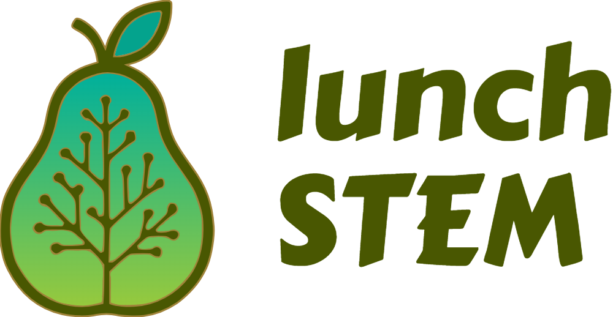
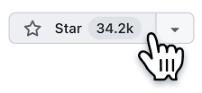
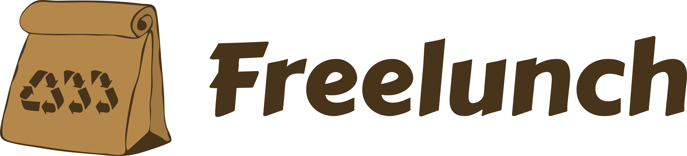

<p align="center">
   
</p>

<h1 align="center">Democratizando conhecimento <i>STEM</i> de forma organizada</h1><br>

<p align="center">
   <strong>🌟 Projeto sem fins lucrativos e de código aberto 🌟</strong>
</p>

<p align="center">
   <em>Pense numa Wikipedia melhor para <i>STEM</i>.<br>
   É como o FreeCodeCamp, mas para documentos (e não apenas para Engenharia de Software).</em>
</p>

<p align="center">
   <a href="https://discord.gg/W6wmJbZx">
      
   </a>
</p>

<p align="center">
   <a href="README.md">
      
   </a>
   <a href="README.es.md">
      
   </a>
   <a href="README.zh.md">
      
   </a>
   <a href="README.pt.md">
      
   </a>
   <a href="README.fr.md">
      
   </a>
   <a href="README.de.md">
      
   </a>
</p>

<h2 align="center">⭐ Dê uma Estrela ao Projeto</h2>

Se você acha o lunchSTEM útil, por favor considere nos dar uma estrela no GitHub! Isso nos ajuda a alcançar mais pessoas e nos mantém motivados.

<p align="center">
   <a href="https://github.com/Freelunch-AI/lunch-stem">
      
   </a> <br>
   <em>Imagem de Exemplo</em>
</p>

---

> [!WARNING]
> **⚠️ Importante**
> 
> Documentos no *lunchSTEM* são criados por autores externos, não por nós. Não apoiamos a inclusão de documentos não distribuíveis sem permissão do autor (para documentos não distribuíveis: verifique `author_permissions.jsonl`).
> 
> Cada documento credita seu(s) autor(es) num arquivo correspondente `<nome_arquivo>.<extensão_arquivo>.source.json`.
> 
> Autores podem solicitar remoção de conteúdo a qualquer momento. Após seguir nosso protocolo simplificado para *Solicitações de Remoção de Conteúdo*, removemos o conteúdo em 24 horas. Esta opção é mais rápida e amigável que uma notificação da *Lei de Direitos Autorais do Milênio Digital (DMCA)* (que pode fechar o projeto).

> [!NOTE]
> **🟩 Em Breve**
> 
> • **Website** com páginas de autores, busca por palavras-chave/semântica, fóruns de discussão sobre documentos, pré-visualização de conteúdo, visualizações interativas de conteúdo, marcação/etiquetagem/favoritos de conteúdo, anotações sobre documentos, documentos populares/em alta, estatísticas para documentos e autores, e mais.
> 
> • **Servidor MCP:** útil para Agentes de IA fazendo trabalho de engenharia complexo ou pesquisa científica.
> 
> • **CLI adequado** onde usuários podem fazer busca por palavras-chave e semântica.

## � Sumário

- [🔍 Visão Geral](#🔍-visão-geral)
- [📊 Estatísticas do Projeto](#📊-estatísticas-do-projeto)
- [🗑️ Solicitações de Remoção de Conteúdo e Atribuição de Créditos](#🗑️-solicitações-de-remoção-de-conteúdo-e-atribuição-de-créditos)
- [📝 Atribuição de Créditos](#📝-atribuição-de-créditos)
- [⚙️ Requisitos para Uso](#⚙️-requisitos-para-uso)
- [🚀 Como Usar](#🚀-como-usar)
- [📁 Estrutura de Diretórios e Convenções de Nomenclatura](#📁-estrutura-de-diretórios-e-convenções-de-nomenclatura)
- [🔬 Cobertura de Campos STEM](#🔬-cobertura-de-campos-stem)
- [🗺️ Tentativa de Roteiro](#🗺️-tentativa-de-roteiro)
- [⚖️ Isenção de Responsabilidade e Termos](#⚖️-isenção-de-responsabilidade-e-termos)
- [💎 Patrocinadores](#💎-patrocinadores)
- [🙏 Agradecimentos](#🙏-agradecimentos)

## �🔍 Visão Geral

Esta é uma base de conhecimento *STEM* (Ciência, Tecnologia, Engenharia e Matemática) em evolução, destinada a ser revisada e melhorada com o esforço da comunidade. Pode ser usada e melhorada por humanos e agentes de IA.

Seu caso de uso ideal é **aprofundar-se num tópico *STEM* (e tópicos relacionados) depois que você tem uma compreensão inicial dele** (que você pode facilmente obter via Google Search ou Assistentes de IA).

Deve ser mais organizada e de maior qualidade (relação sinal-ruído) que a busca padrão do Google/pesquisa profunda de IA para este caso de uso.

O objetivo é, mais tarde, permitir que agentes de IA a usem facilmente como ferramenta fazendo um *Servidor MCP do lunchSTEM*.

## 🎯 Para quem é isto?

- **Estudantes** procurando materiais de aprendizagem complementares
- **Profissionais** querendo aprofundar seu conhecimento STEM
- **Pesquisadores** precisando de materiais de referência organizados
- **Educadores** procurando recursos de ensino
- **Autodidatas** buscando estudo independente

## 📊 Estatísticas do Projeto

- **Tamanho:** 60+ GB (incluindo muitos links)
- **Número de arquivos pdf** 10k+
- **Número de subtópicos** 6k+
- **Idioma dos materiais:** Inglês

## 🗑️ Solicitações de Remoção de Conteúdo e Atribuição de Créditos

Um grande esforço foi feito para detectar e remover conteúdo protegido por direitos autorais (não distribuível), e para reconhecer os autores/editoras/universidades dos materiais restantes. Revisão manual de cada arquivo não pôde ser feita devido à quantidade enorme de arquivos (mas damos as boas-vindas à comunidade para nos ajudar com isso abrindo issues e PRs).
1. Executamos scripts para deletar qualquer arquivo contendo qualquer outra extensão fora de: `.pdf`, `.txt`, `.md`, `.ipynb`, `.json`
2. Executamos scripts para detecção automatizada de palavras-chave relacionadas a direitos autorais em documentos e exclusão de tais documentos
3. Executamos scripts para remoção automatizada de artigos acadêmicos.
4. Substituímos manualmente cada pdf de livro por um link para ele.
5. Executamos scripts para criação automatizada de um arquivo de atribuição de créditos (`.source.json`) para cada pdf restante, com informações como: autores, link para a fonte, modificado ou não, etc. Valor padrão dos campos é `null`, com exceção do valor padrão do campo `changes_were_made` que é `False`. Valores padrão são usados quando a informação não pode ser encontrada no próprio pdf.

Contudo, não podemos garantir perfeição neste processo, portanto, se você encontrar qualquer conteúdo protegido por direitos autorais ou conteúdo sem dados adequados de atribuição de créditos, por favor abra um issue e/ou faça um PR e/ou envie um email para bruno.c.scaglione@gmail.com. Visamos resolver o problema em 24h. Consulte o arquivo `CONTRIBUTING.md` para as diretrizes sobre isso.

> **Protocolo Simplificado para Solicitações de Remoção de Conteúdo (Recomendado sobre _DMCA_)**
   > 1. Leia CONTRIBUTING.md para ver diretrizes de issues
   > 2. Abra um issue de *solicitação de remoção de conteúdo*
   > 3. Envie um email para bruno.c.scaglione@gmail.com com o assunto "[lunchSTEM] Solicitação de Remoção de Conteúdo: #NUMERO_DO_ISSUE_GITHUB_PLACEHOLDER" explicando: quem você é, o caminho do(s) conteúdo(s) que precisa(m) ser removido(s) e link para o issue específico que você abriu.

<br>

> Esta opção é __mais rápida e mais amigável que uma notificação *DMCA*__. Se recebermos múltiplas notificações *DMCA*, o projeto corre o risco de ser removido do *Github* (mesmo após retirar os conteúdos) e muitas pessoas que poderiam se beneficiar dele serão afetadas.

**Conformidade com a *Lei de Direitos Autorais do Milênio Digital* (*DMCA*):** cumprimos com a Lei de Direitos Autorais do Milênio Digital (DMCA). Para solicitações formais de remoção, por favor siga o processo *DMCA*.

## 📝 Atribuição de Créditos

Dados de atribuição de créditos de um arquivo pdf são armazenados em `<nome_arquivo>.pdf.source.json` que deve ser aberto diretamente (sem `dvc pull`). Este arquivo pode conter autores, universidade, editora, link para a fonte, e outros metadados sobre o arquivo específico que referencia. Valor padrão dos campos é `null`, com exceção do valor padrão do campo `changes_were_made` que é `False`.

## ⚙️ Requisitos para Uso

Certifique-se de ter essas ferramentas instaladas:

- `git`
- `rclone`

Estas podem ser instaladas seguindo seu respectivo guia de instalação em seus websites.

- [guia de instalação do git](https://git-scm.com/book/en/v2/Getting-Started-Installing-Git)
- [guia de instalação do rclone](https://rclone.org/install/)

> [!NOTE]
> Ao configurar um armazenamento remoto para _rclone_, certifique-se de usar a opção de conta de serviço e `lunch-stem-fadf503639fe.json` como arquivo de conta de serviço.

## 🚀 Como Usar

1. **Abra um terminal**: Para abrir o terminal, use a funcionalidade de busca do seu sistema operacional (pressionando a tecla Windows ou Cmd + Espaço no Mac) e digite "terminal", "prompt de comando" ou "Windows Terminal" e selecione o aplicativo

2. **Clone o repositório com git** (este comando criará uma pasta `lunch-stem` no seu diretório atual)

   ```bash
   git clone https://github.com/Freelunch-AI/lunch-stem.git
   ```
   > [!NOTE]
   > Se você estiver usando Windows, é importante clonar dentro de um diretório de nível superior, para evitar erros potenciais relacionados à criação de caminhos de arquivo muito longos. O Windows tipicamente tem um caminho de arquivo máximo de 260 caracteres.

3. Entre na pasta `lunch-stem`

   ```bash
   cd lunch-stem
   ```

4. Configure o projeto

   **Para Linux**

   Habilite execução de scripts

   ```bash
   chmod +x scripts/setup 
      ```

   Execute script de configuração

   ```bash
   source scripts/setup 
      ```

   **Para Windows:**

   Habilite execução de scripts dentro da sessão do terminal

   ```powershell
   Set-ExecutionPolicy -ExecutionPolicy Bypass -Scope Process
      ```

   Execute script de configuração

   ```powershell
   scripts/setup.ps1
      ```

5. **Navegue dentro da pasta `ai2f`**

6. **Baixe arquivos pdf:**

   - Para arquivos `.pdf.dvc`

      **Baixe arquivos pdf específicos via:**

      ```bash
      lunch files "<first/dvc/file/path/placeholder.pdf.dvc>" "[second/dvc/file/path/placeholder.pdf.dvc]"
      ```

      onde você pode colocar múltiplos caminhos de arquivos, apenas o primeiro é obrigatório.

      Este comando obterá os arquivos `.pdf` e os colocará no seu diretório atual.

      Se você quiser colocar arquivos no mesmo lugar que o arquivo `pdf.dvc ` então use:

      ```bash
      lunch files "<first/dvc/file/path/placeholder.pdf.dvc>" "[second/dvc/file/path/placeholder.pdf.dvc]" --in-place 
      ```

      - _Nota 1:_ o primeiro argumento de caminho de arquivo é obrigatório, o resto é opcional.
      - _Nota 2:_ o caminho do arquivo usado neste comando não deve ter `.source.json` no final. deve terminar com `.pdf.dvc`.
      - _Nota 3:_ outros tipos de arquivo (ex., `.txt`) devem ser abertos diretamente, sem usar a CLI do lunch.
      - _Nota 4:_ se `.web.txt` estiver presente, então você não deve tentar este comando, apenas copie e cole o link dentro de `.web.txt` em seu navegador. Implementaremos um `lunch get` mais tarde para buscar arquivos da web.
      - _Nota 5:_ o arquivo `.pdf` não deve estar visível antes de você executar este comando.
      - _Nota 6:_ você pode obter os caminhos dos arquivos através da interface gráfica do usuário do seu Sistema Operacional, cada sistema operacional tem uma maneira fácil.


      **Baixe todos os arquivos de uma pasta específica via:**

      ```bash
      lunch folder "<folder/path/placeholder>"
      ```

      Se você quiser colocar os novos arquivos pdf no mesmo lugar que seus arquivos `pdf.dvc` correspondentes então use:

      ```bash
      lunch folder "<folder/path/placeholder>" --in-place
      ```

      Se você quiser baixar todos os arquivos de todos os subdiretórios (recursivamente) então use:

      ```bash
      lunch folder "<folder/path/placeholder>" --recursive
      ```

      Se você quiser colocar arquivos no mesmo lugar que o arquivo `pdf.dvc ` e para todos os subdiretórios então use:

      ```bash
      lunch folder "<folder/path/placeholder>" --in-place --recursive
      ```
      Para depuração, use a flag `--verbose`.

   - Para arquivos `pdf.web.txt`:

      Simplesmente abra o arquivo e siga o link web dentro dele.

   - Para arquivos `.sym.txt`:

      Simplesmente abra o arquivo e navegue até o caminho do arquivo ou pasta escrito dentro dele. Este arquivo ou pasta estará dentro do `__Loopback`.

## 📁 Estrutura de Diretórios e Convenções de Nomenclatura

- O diretório **`__Loopback`** contém arquivos que tinham um caminho muito longo. Um arquivo ponteiro `.sym.txt` foi criado no lugar desses arquivos apontando para o arquivo real localizado dentro do diretório `__Loopback`. Estes arquivos txt ponteiro seguem esta convenção de nomenclatura: `nome_arquivo.extensão_arquivo.sym.txt` e estão localizados no mesmo diretório onde o arquivo real deveria estar.

- O arquivo **`to_add.txt`** na raiz contém links para materiais a serem incluídos posteriormente no lunchSTEM.

- Arquivos ou pastas começando com **MEGA** indicam materiais agregadores (materiais que agregam um monte de links sobre um tópico específico).

- Arquivos ou pastas começando com **Awesome** indicam conteúdo de qualidade super alta.

## 🔬 Cobertura de Campos _STEM_

### Campos Mais Fortes

*lunchSTEM* está no momento mais completo nos campos de `Computer Science & Engineering` e `AI` especificamente.

### Campos Mais Fracos

Os campos de `Hardcore Science` (Física, Química, Biologia, Economia) são notavelmente mais superficiais em termos da profundidade de sua árvore de tópicos.

## 🗺️ Tentativa de Roteiro

> **Nota:** Passos com a mesma **[letra]** podem ser feitos em paralelo.

### Fase A: Problemas Fundamentais

1. **[b][a]** Criar convenção de nomenclatura de branches e regras de branches.

2. **[a]** Resolver problemas urgentes de direitos autorais e atribuição de créditos relacionados aos arquivos reais sendo armazenados
   - Fazer script CI que constrói uma lista de caminhos `.source.json` que não têm informação de autor - estes devem ser prioridade.

3. **[a]** Substituir arquivos reais (e links de homepage/ponto de entrada) com links para obter os arquivos diretamente do seu host original (usar um agente de IA usando navegador para ajudar com isso). O objetivo é que a maioria dos arquivos seja `nome_arquivo.extensão_arquivo.web.txt` com o link dentro dele (ou seja, arquivo hospedado externamente). Usuários ainda podem contribuir com arquivos reais se forem os autores desses arquivos (como o *arXiv* faz) porque internamente ainda estaremos usando DVC para arquivos reais.

4. **[a]** Implementar symlinks adequados que funcionem em todos os Sistemas Operacionais. Não mais procurar manualmente o caminho dentro do arquivo `.sym.txt` e ir manualmente para aquele diretório. Também implementar weblinks fáceis, para evitar copiar/colar manual de caminhos dentro de `.web.txt` para o navegador.

### Fase B: Adições Importantes

5. **[b][a]** Criar um *CLI do lunchSTEM* adequado (não em bash, com docstrings, modular, com testes, compilado) pacote/instalável onde você pode:
   1. Obter arquivos ou diretórios (já implementado de forma básica)
   2. Ocultar/Mostrar certos tipos de arquivo (ex., ocultar: .dvc, .source.json, .prerequisites.json, symlinks para outros sistemas operacionais, etc)
   3. Fazer busca: busca por palavras-chave e busca semântica

6. **[b]** Fazer um *Servidor MCP do lunchSTEM*: primeiro, precisa criar uma versão `.md` de cada `.pdf`

7. **[b][a]** Fazer um website para facilitar o consumo do *lunchSTEM* por humanos, onde usuários podem:
   1. Visualizar e navegar o repositório como um gráfico
   2. Usar busca por palavras-chave, baseada em filtros e semântica
   3. Ver prévia de documentos sem ter que abri-los
   4. Abrir documentos diretamente no navegador
   5. Dar estrela a um documento
   6. Fazer sua própria etiquetagem/favoritos sobre os materiais, que só será visível para eles.
   7. Fazer destaques e notas em materiais que só serão visíveis para eles
   8. Ver páginas de autores que linkam para todos os materiais de um autor específico.
   9. Participar em fóruns de discussão sobre documentos específicos
   10. Ver documentos e autores populares/em alta
   11. Ver estatísticas para documentos e autores

8. **[b]** Conseguir patrocinadores e subsídios para: (1) apoiar nossa hospedagem de aplicativo; (2) construir uma equipe dedicada de mantenedores do *lunchSTEM*; (3) pagar especialistas para processos de revisão por pares; e (4) direcionar uma porcentagem do dinheiro para autores contribuintes. Todo dinheiro de patrocínio seria reinvestido no projeto, é um projeto sem fins lucrativos.

9. Criar Fluxos de Trabalho CI

   1. **[b][a]** Substituir arquivos `.pdf` reais com arquivos `.pdf.dvc`, evitando arquivos de conhecimento reais no repositório.

   2. **[b][a]** Adicionar remoção de arquivo malicioso, remoção de arquivo grande, remoção de repositório git, remoção de arquivos com extensões não aceitas, remoção de material protegido por direitos autorais, etc para automaticamente evitar PRs ruins.

   3. **[b][a]** Adicionar aplicação de convenções padrão no CI para manter a base de conhecimento consistente, evitando PRs inconsistentes.

### Fase C: Mais Características Principais

10. **[b][c][d]** Adicionar características ao *lunchSTEM*, potencialmente usando *AgentPool* para ajudar (em paralelo: continuar adicionando mais materiais de `to_add.txt`, mas adicionar como `nome_arquivo.extensão_arquivo.web.txt` com o link HTTPS dentro do arquivo):
    - **Pré-requisitos:** Adicionar `[nome_arquivo.[extensão_arquivo].prerequisites.json` contendo lista hierárquica de pré-requisitos para cada arquivo
    - **Exercícios:** Colocar exercícios com soluções em cada diretório de tópico dentro de `__Exercises`
    - **Ferramentas:** colocar ferramentas de software em cada tópico dentro de `__Tools`. Podem ser ferramentas para fazer ou entender algo relacionado ao tópico.
    - **Trilhas de Aprendizado e Certificação:** trilhas sequenciais guiadas (ex., trilha de Engenheiro ML) com tempo estimado de conclusão de 3 ou 6 meses, e com um exame/certificação interno ou externo no final.
    - **Projetos de Exemplo:** Colocar projetos de exemplo em cada diretório de tópico dentro de `__Sample Projects`
    - **Assistente de IA dentro do CLI do lunchSTEM para tornar seu documento mais fácil de entender**: pode adicionar diagramas, notebook, escrevemos em palavras mais fáceis de entender, fazer exemplos, etc. Um conjunto de dados de treinamento/prompting pode ser gerado piorando sinteticamente materiais de aprendizado bons de propósito.
    - **Tutor de IA que usa lunchSTEM como sua base de conhecimento**: tutor que pode fazer guias de estudo personalizados, explicar blocos de texto ensinando todos os seus pré-requisitos necessários, fazer materiais interativos personalizados, etc
    - **Revisor por Pares de IA que usa lunchSTEM como sua base de conhecimento**: construir um Agente de IA capaz de revisar novos documentos *STEM* incluídos em PRs (e que não estão na lista de fontes respeitadas), para evitar ter que depender de revisões por pares humanas que são lentas e custosas. Revisões por Pares Humanas devem então ser feitas anualmente para capturar erros do Revisor por Pares de IA e gerar dados para melhorar o Revisor por Pares de IA em seus pontos fracos.
    - **Universidade lunchSTEM:** universidade gratuita online para pessoas que preferem prazos rigorosos, responsabilidades e aprender com outros. Sem exames. A cada ano, estudantes construirão tecnologias ou métodos existentes do zero, inspirados em [build-your-own-x](https://github.com/codecrafters-io/build-your-own-x) junto com uma monografia com todos os detalhes importantes e compartilharão com a comunidade via post de blog. Estudantes terminam a universidade com um portfólio estelar para mostrar. Abordagem de ensino top-down onde ajudamos estudantes a aprender tópicos sob demanda quando precisam para construir algo.

### Fase D: Melhorias Legais de Ter

11. **[d]** Migrar do *Google Drive* (eu já estava pagando por 2TB, por isso usei) para uma opção de armazenamento melhor (ex., *S3*).

12. **[d]** Fazer *AgentPool*: equipe de agentes diversos que fazem PRs para o repositório *lunchSTEM* após discussões internas, fazendo perguntas aos humanos e avaliando mudanças propostas por fine-tuning de SLMs. Agentes são continuamente modificados para garantir diversidade e melhorar sua inteligência baseada em novo conhecimento aprovado adicionado ao *lunchSTEM*.

## ⚖️ Isenção de Responsabilidade e Termos

**BASE COMO ESTÁ:** Este projeto é fornecido "como está" sem garantias de qualquer tipo. Não fazemos representações sobre a precisão, completude ou legalidade do conteúdo.

**LIMITAÇÃO DE RESPONSABILIDADE:** Na máxima extensão permitida por lei, os mantenedores do projeto não serão responsáveis por quaisquer danos decorrentes do uso deste repositório.

**TERMOS DE SERVIÇO:** Ao usar este repositório, você concorda em respeitar leis de direitos autorais, usar conteúdo apenas para fins educacionais, e cumprir com todas as leis aplicáveis na sua jurisdição.

**NÃO É ACONSELHAMENTO LEGAL:** Nada neste repositório constitui aconselhamento legal, financeiro ou profissional.

**Propósito Educacional:** Este projeto visa fornecer acesso organizado a materiais educacionais para fins educacionais não comerciais. Acreditamos que muitos usos do conteúdo podem se qualificar para proteções de uso justo, mas determinações de uso justo são feitas caso a caso pelos tribunais.

## 💎 Patrocinadores

__Quer ser um patrocinador? Envie um email para bruno.c.scaglione@gmail.com com o assunto "[lunchSTEM] Patrocínio"__ 

## [Freelunch](https://freelunch.dev)



## 🙏 Agradecimentos


